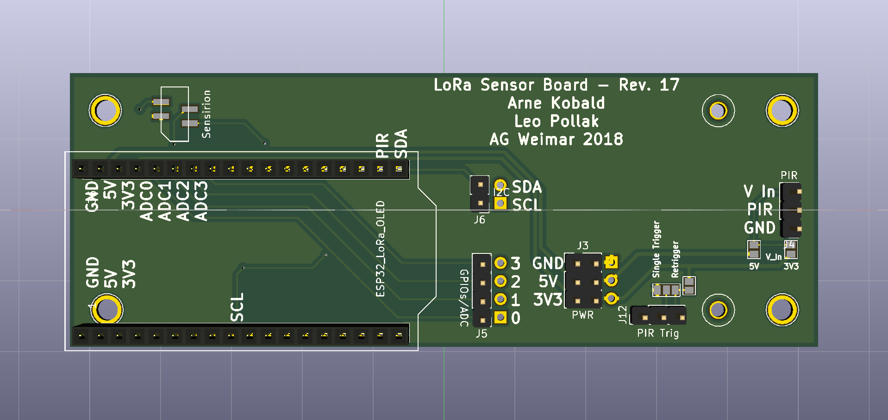
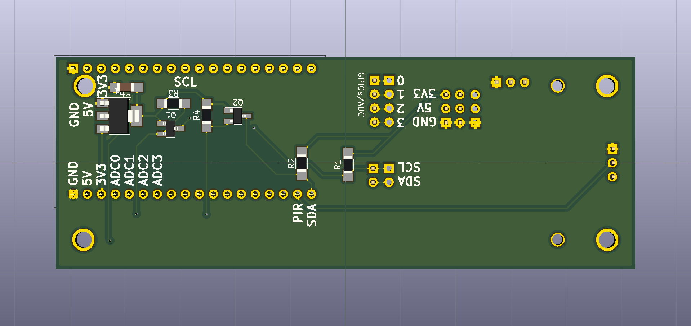

# hackTM

## Hardware  
The sensor board/shield holds three major components, namely:
* ESP32 breakout board with LoRa antenna and OLED display
* Flex Cable including I2C addressable Sensirion SHTC01 (rel. humidity and temperature) and SGP30 (four pixel MOX sensor giving a tVOC and eCO_2 reading)
* Passive infrared sensor (PIR) a.k.a. motion sensor

A top view of the board is shown below:

### ESP32  
The ESP32 breakout board is put in the socket on the lower left of the board. The usb port is facing outwards, so the board can be powered from an external (USB) power supply.
On the bottom side of the ESP32 board a small LiPo battery can be connected. Charging this battery takes place via the USB port.  
_Caution_: When booting or running the board the LoRa antenna must be connected!  
[Schematic](https://download.bastelgarage.ch/Datasheet/WIFI_LoRa_32_868_Schema.png)
[Pinout](https://download.bastelgarage.ch/Datasheet/WIFI_LoRa_32_Pinout.pdf)

### Flex cable  
The flex cable is put in the FFC socket above the ESP32 board. It is to be mounted in such a fashion, that the sensors face upwards when the cable is bent to the right (parallel to the ESP32 board).  
[SGP30 Datasheet](https://www.sensirion.com/fileadmin/user_upload/customers/sensirion/Dokumente/0_Datasheets/Gas/Sensirion_Gas_Sensors_SGP30_Datasheet.pdf)  
[SHTC1 Datasheet](https://www.sensirion.com/fileadmin/user_upload/customers/sensirion/Dokumente/0_Datasheets/Humidity/Sensirion_Humidity_Sensors_SHTC1_Datasheet.pdf)  
Side note: The Sensirion sensors are powered with 1.8V. The electrical components taking care of voltage generation and conversion (for the I2C bus, including 10k pull-up resistors) are situated on the bottom side of the sensor board - see picture below:

## PIR
The PIR sensor is placed on the right side of the sensor board. It produces a digital Signal (TODO high oder low??? ) whenever a motion was detected. The sensor is internally powered by 3.3V. This voltage is generated on the PIR board by a voltage regulator.
The solder jumper labeled 'V_In' on the right side selects the input voltage - either 5V or 3.3V. Keep in mind that the 5V is only 'stable' when powered via USB.
Another (prefered and thus default) way to power the PIR Board is the second socket strip on the lower side. Originally those pins are designed to select the trigger mode (explained later). However, the outer two pins are connected to ground and 3.3V of the PIR sensor.
This enables the option to surpass the PIR's voltage regulator and save energy by directly supplying 3.3V.  
Via the solder jumpers labelled 'Single Trigger' and 'Retrigger' it can be selected if retriggering is possible. Retriggering is the possibility of increasing the duration of the digital output signal, when additional motion(s) are detected.
If 'Single Trigger' is selected the output signal will return to its default state () when a certain time has passed after detecting the first motion. Only now new motions cann trigger the sensor. The pulse length of the output signal can be selected with the left (when mounted upper) trimmable potentiometer.
The right (when mounted lower) potentiometer adjusts the sensitivity of the PIR sensor.  
[Example Datasheet](https://www.mpja.com/download/31227sc.pdf)

## Extras  
In addition to the previously mentioned features extra pins can be found on the sensor board. These are broken out pins (as well as solder eyelets) to conveniently expand the board.
They include the power pins (5V, 3.3V and GND - 5V may be limited to USB use) as well as the I2C pins SDA and SCL (3.3V level). Furthermore 4 GPIOs are broken out. Those can be used for a wide variety of scenarios.
All of them can be configured via software to be digital or analogue for different I/O devices. These pins could also be used as an SPI bus.

## Quickstart esp32

Of course you can use your favourite IDE or even a simple text editor to code. However, below are a few suggestions of tools, that could make your life much easier.  
In order to copy files to the board you could use different libaries.

### mpy utils  
[mpy-utils](https://github.com/nickzoic/mpy-utils) establishes a Filesystem in userspace connection to the board and allow you to change files directly on the board. (very handy)bla
_doesn't work on Windows_

### ampy
[ampy](https://github.com/adafruit/ampy) is used to interact with your esp32 board via serial connection.

### Atom with Pymakr Plugin
[Atom](https://atom.io/) can be used with the Pymakr Plugin (see [here](https://docs.pycom.io/chapter/pymakr/installation/atom.html) for help). Now you can use the powerful REPL (_Read-Evaluate-Print-Loop_),
which greatly helps while debubbing or prototyping. You can also run a pre-written script with just a click of a button (without uploading first).

### esptool.py
[esptool](https://github.com/espressif/esptool) is needed for flashing your esp32 with new firmware.